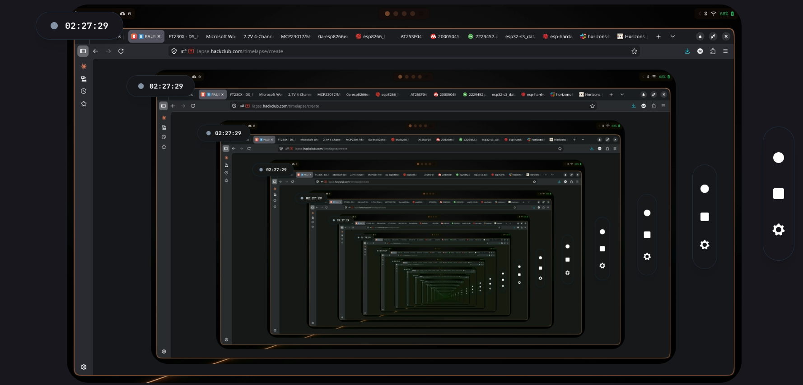
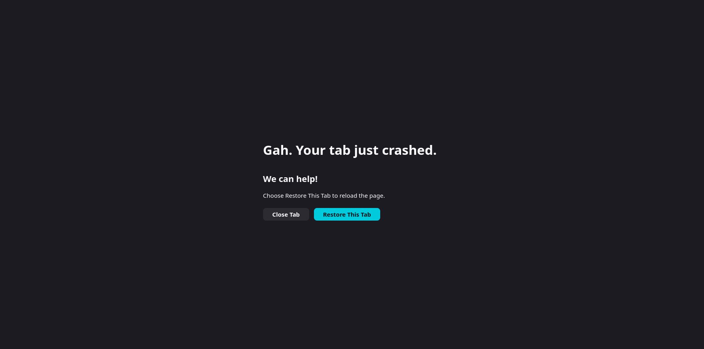
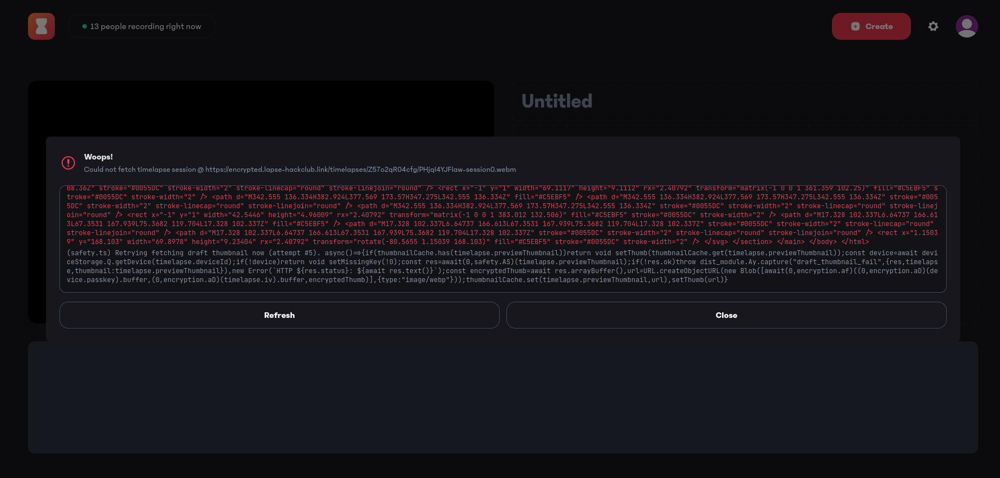

# May 24th, Afternoon: Starting this journal, and adding components.

Started initial schematic and added entire main PCB

**Total time spent: 1h 4m**

# May 24th, Evening: Motive changes and extra additions 

Added more components like a SPI DAC, GPIO extender, and a USB Controller. Changing this project motive to an avionics board.

**Total time spent: 50m**

# May 25th: Added coprocessor for AI engine 

Added and finalized a serial connection with the AI side and low level hardware side.

**Total time spent: 43m**

# May 26th: Redid the entire project only to loose it all, I'm gonna cry

I redid the entire PCB design and added supporting capacitors, diodes, and the likes. When I was finishing my timelapse disaster struck, my laptop ran out of RAM and my tab crashed while saving, I lost ~3 hrs of work. Support can't do anything either. My blood is boiling as of writing this...

(unoffical)
**Total time spent: 2h 39m**
