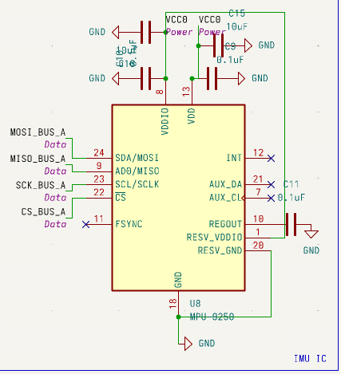
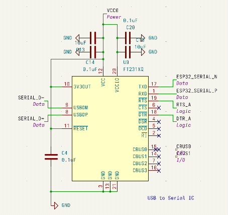
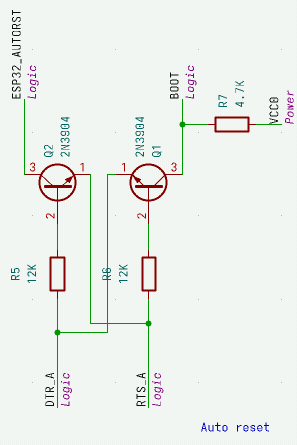
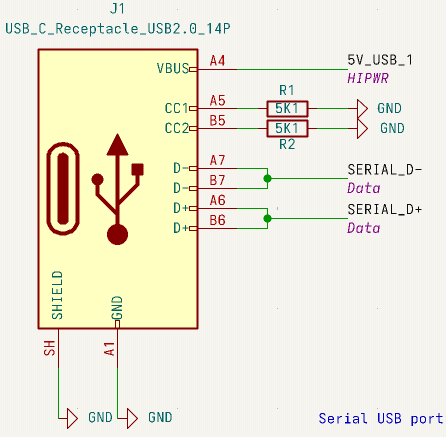
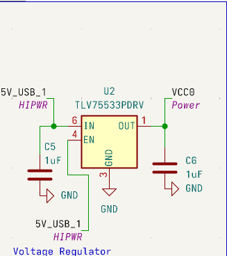
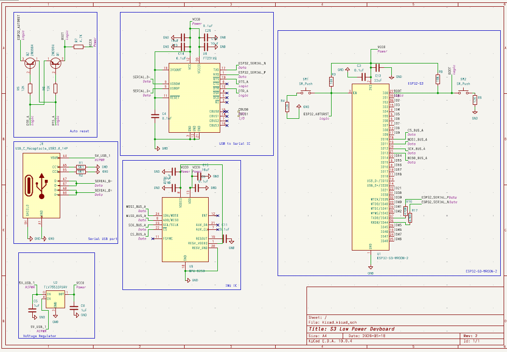

# Mk1

Mk1 is the internal name of this project. I am using this as a way to learn about PCB design and embedded systems and make a "final" out of it. The "final" that I have made is a simple, low-cost, ESP32-S3 development board. I originally added tons of sensors and complexity but shaved them off to make the project more attainable. The board functions similar to most other boards, boasting a USB to Serial converter, a sample IMU sensor for SPI testing, and extra essentials like auto reset circuits and a voltage regulator. The board has gone well but I advise most to not use any of these designs for future projects of their own. If you do, don't be surprised when it blows up in your face.

Journal logs are in the /documentation folder of this repo

The schematic breakdown goes as follows:

# The ESP32-S3

The power rails start with two decoupling capacitors before then merging with reset and boot cicuits through pull up resistors

# The IMU

The IMU is a simple MPU-9250 following the schematic posted its online datasheet

# USB to Serial IC

The USB to Serial IC is a FTDI FT231XQ also following the schematic posted in its datasheet

# Auto reset

The auto reset circuit is a set of two 2N3984 transistors that feed into the DTR and RTS pins of the FT231XQ, When a handshake is sent by the flashing device the devboard can enter bootloader states without the need of a button press on the board, though the buttons are still included as a fallback

# USB Port

The port is simple with only two 5K1 resistors for USB power negotiation on both sides.

# Voltage regulator

The voltage regulator includes one TLV75533PDRV from TI and decoupling capacitors on power ins and outs. And the reset pin is tied to power to keep the chip on while the board has power.

# Overall

The PCB is extremely messy.
