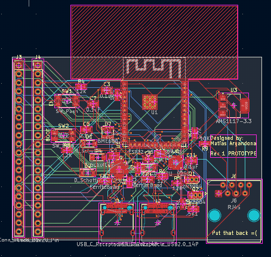
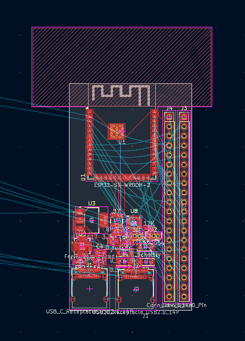

# May 24th, Afternoon: Starting this journal, and adding components

Started initial schematic and added entire main PCB

-Matias

**Total time spent: 1h 4m**

# May 24th, Evening: Motive changes and extra additions

Added more components like a SPI DAC, GPIO extender, and a USB Controller. Changing this project motive to an avionics board.

-Matias

**Total time spent: 50m**

# May 25th: Added coprocessor for AI engine

Added and finalized a serial connection with the AI side and low level hardware side.

-Matias

**Total time spent: 43m**

# May 26th: Redid the entire project only to loose it all, I'm gonna cry

I redid the entire PCB design and added supporting capacitors, diodes, and the likes. When I was finishing my timelapse disaster struck, my laptop ran out of RAM and my tab crashed while saving, I lost ~3 hrs of work. Support can't do anything either. My blood is boiling as of writing this...

-Matias

(unoffical)
**Total time spent: 2h 39m**

# May 26th, almost 27th, Midnight: Attempts at reimbursing lost hours

I worked for about and hour and a half just redoing more PCB work overtime to contrast the 2+ Hrs lost =(((. Still working and going strong. I better get into nexus istg.

For this session I added supporting components to the ESP32-S3 AI module, still on the fence about the motives for this project but whatever. The only thing getting me through all this work is me and my Radiohead albums against the world, I listened to Hail to the Thief at least five times today, heavy on <em>Wolf At the Door</em> By Radiohead, totally my favorite song in the album. I gotta touch up on my markdown skills for this journal lmao.

I'm looking back an realizing I kinda need to be more descriptive with these entries.

I'm tired...

Signing off at 23:55:19.

Goodnight.

-Matias

**Total time spent: ~1.5hrs**

# May 27th, 11:00AM: Back at it again

Added and did more work on the AI coprocessor and crystal, I also put together the connections for the sensing board and I2C bus for the main hub, I might add a second display module, I don't know. I'm going to come back this evening add add and research a radio unit, who knows. I currently have like five hours of Radiohead listening time this month on Amazon Music and It's not slowing down, it's me and my Radiohead  albums against the world. :cry:

-Matias

**Total time spent: 1h 6m**

# May 27th, 2:00PM: Sensing board redos and fixing the toast I2C bus

I fixed and replaced the original RJ12 telephone jack and added a new RJ45 to carry the I2C bus, I also set up the INT pin on the bus and did the sensor board. Yay me!

I forgot the radio board and ran out of time, I gotta run now.

-Matias

**Total time spent: 55 mins**

# May 24th, 5:00PM: Vision research and a lot of datasheet reading

This time, instead of working on the PCB I did some research for what I can use for AI vision, I'm beginning to think I can't... I don't know, I didn't do a lot though.

-Matias

**Total time spent: 1hr**

# May 29th: Finished schematics

Today, I finished the schematics and yesterday I redid them again but could not track time :sad:. Today I did research on transistors, added reset, boot, and power OR circuits, I also arranged and set footprints for each component. Yay!

-Matias

**Total time spent: 2hrs 13mins**

# May 31st: Started Schematics

Today I just added footprints for some generic components and then I started PCB floorplanning, not a lot of work done.

-Matias

**Total time spent: 14min**

# June 1st: Started PCB traces and more floorplanning

Today I started traces but then decided to scrap it for more effective floorplanning of the PCB, to be fair this is my first time so I don't expect to be super good at this.

(P.S: floorplaning is the layout without traces of the PCB components)

-Matias

# June 2nd: Almost done with PCB design

Today I continued on with PCB design and did most of the tracing and heavy lifting, I connected all components including the BME680, the MPU9250, the ESP32-S3, the AMS1117, the IO pins, the RJ45 and USB-C connectors, and the FT230X with all of the capacitors and extra components for them. I set up the board and did some research about vias, traces, and guidelines and multilayering, once finished I started the design process copying down each design from schematic to PCB, next I need to do some tweaking and finish IO connections for the PCB.

-Matias

# June 17th: Done with Rev1

After a while I finally finished revision one for the PCB, Yay me! I have not touched this project in a while due to school, but not that school's out I can finally have time to work on this. I'm so glad that after so many setbacks I finally finished the first revision. I'm happy and hopeful for what is to come!

-Matias

No thumbnail here

# June 18th: Restarting the project, again

The original first revision was a compleate blow out, the traces were messy and long and the floorplanning sucked, after some review from other sources online I realized that my project was sure enough not going to work. Instead of giving up I saved the file, duped it into the archives and started a new project. I trimmed down the layers to only two and then I got to work, I stared off by making new DRC checks and now I'm learning how to make custom rules with trace width and clearance. I also make the board much much smaller and made the components much tigher spaced. The top image is the original board.

